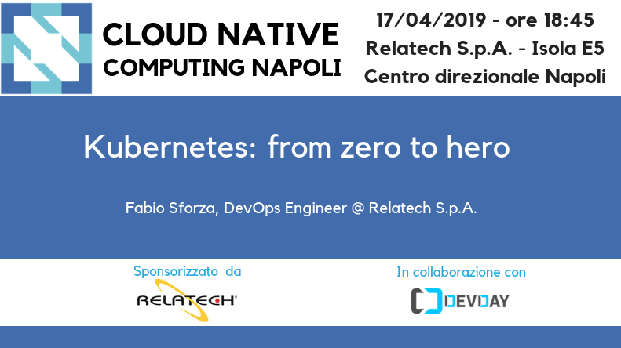

# Kubernetes: from zero to hero - April 17, 2019

Following the material from the **"Kubernetes: from zero to hero"** [meetup](https://community.cncf.io/events/details/cncf-cloud-native-computing-napoli-presents-kubernetes-from-zero-to-hero/) on April 17, 2019 by [Fabio Sforza](https://twitter.com/fabio_sforza), DevOps Engineer @ Relatech S.p.a.

Kubernetes has now become the de facto standard for deploying containerized applications at scale in private, public and hybrid cloud environments. During this session, we will introduce its main concepts and explain them, step by step, by practical examples. The talk will guide developers to learn all the best practices to perform a production-ready deployment for a Java Spring Boot based microservice and a MySQL database.

* [slides](kubernetes-from-zero-to-hero.pdf)
* [demo](https://github.com/fsforza/kubernetes-demo)
* [video](https://www.youtube.com/watch?v=e8PGyHAxj8w)