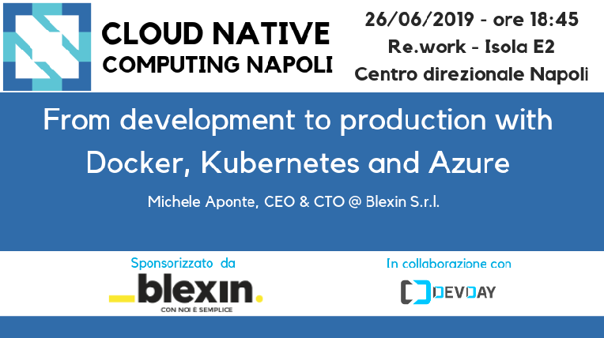

# From development to production with Docker, Kubernetes, and Azure - June 26, 2019

Following the material from the **"From development to production with Docker, Kubernetes, and Azure"** [meetup](https://www.meetup.com/cncfnapoli/events/261921731/) on June 26, 2019 by [Michele Aponte](https://twitter.com/apomic80), CEO & CTO @ Blexin S.r.l.

In the nowadays cloud era, the question everyone asks is which vendor to choose and at what cost you can risk making a wrong choice. And if you want to start from on-premise and then migrating to the cloud, the cost can be even higher. Choosing Docker for containerization and Kubernetes as an orchestrator gives you the peace of mind that you can make these choices by reducing the technical debt as much as possible since the main Cloud vendors provide a Kubernetes cluster that is easily manageable and scalable. In this session, we will see how to bring an application to Azure using AKS (Azure Kubernetes Service) and what specific vendor implementation details can be taken into account.

* slides
* demo