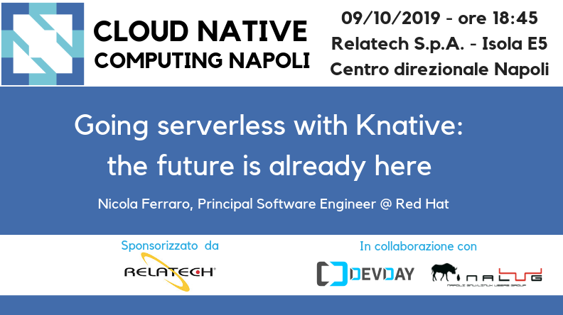

# Going serverless with Knative: the future is already here - October 9, 2019

Following the material from the **"Going serverless with Knative: the future is already here"** [meetup](https://www.meetup.com/cncfnapoli/events/264641751/) on October 9, 2019 by [Nicola Ferraro](https://twitter.com/ni_ferraro0), Principal Software Engineer @ Red Hat.

Serverless technologies offer a new way to deal with infrastructure in the cloud, with a different approach that affects both technical development and costs. Knative, an open source project started in mid 2018 and now reaching GA, is emerging as a foundation for adding serverless capabilities on top of Kubernetes. The future seems bright, but companies still struggle to find a path for adopting such technologies and integrating them with their existing applications.

In this session, we’ll discuss how serverless technologies can change the way modern applications are developed, why they should be adopted and especially how.
With the help of a demo, we’ll explore the most important features of Knative, such as auto-scaling, scaling to zero and event-based communication.

We’ll see where such features are helpful and how it’s possible to connect existing applications and cloud services to Knative to leverage the new possibilities. In this context, we’ll present “Camel K”, a lightweight integration platform “born on Kubernetes, with serverless superpowers”, that brings the legendary integration patterns of Apache Camel into the Knative world.

* [slides](going-serverless-with-knative.pdf)
* [demo](https://github.com/nicolaferraro/knative-demo)