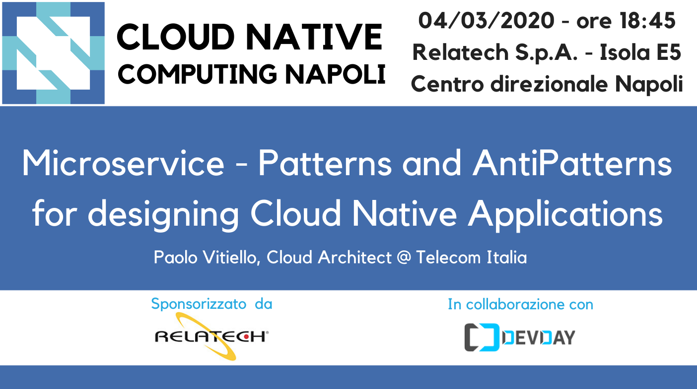

# Microservice - Patterns and AntiPatterns for designing Cloud Native Applications - March 4, 2020

Following the material from the **"Microservice - Patterns and AntiPatterns for designing Cloud Native Applications"** [meetup](https://www.meetup.com/cncfnapoli/events/268653372//) on March 4, 2020 by [Paolo Vitiello](https://twitter.com/paolovitiello), Cloud Architect @ Telecom Italia

Microservice is about creating lots of small, distributed single purpose services, with each service owning its own data. This service and data coupling supports the notion of a bounded context and a share-nothing architecture, where each service and its corresponding data are compartmentalized and completely independent from all other services, exposing only a well-defined interface (the contract). This bounded context is what allows for quick and easy development, testing, and deployment with minimal dependencies. 
In this talk we will analyze the typical models of a microservice architecture. The talk does not simply want to explore what is good in this approach, but wants to highlight the wrong models that often reduce the benefits.

* slides
* demo