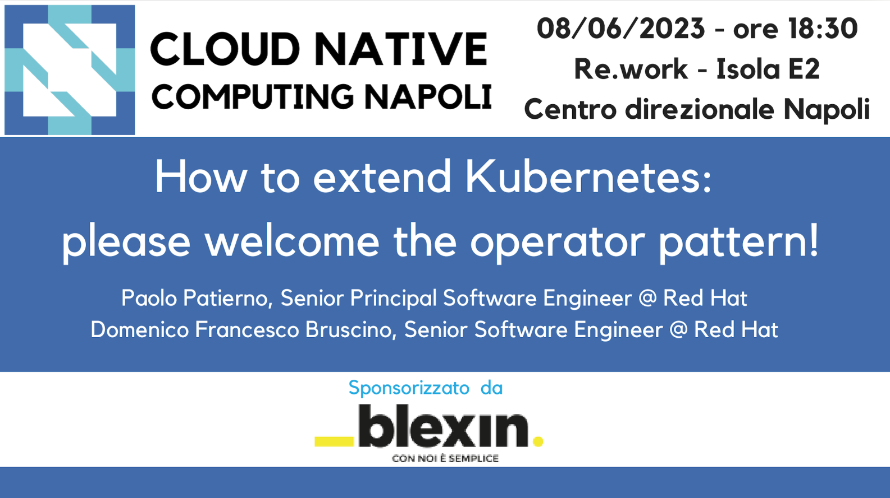

# How to extend Kubernetes: please welcome the operator pattern! - June 8, 2023

Following the material from the **"How to extend Kubernetes: please welcome the operator pattern!"** [meetup](https://community.cncf.io/events/details/cncf-napoli-presents-how-to-extend-kubernetes-please-welcome-the-operator-pattern/) on May 16, 2023 by [Paolo Patierno](https://twitter.com/ppatierno), Senior Principal Software Engineer @ Red Hat, [Domenico Francesco Bruscino](https://twitter.com/bruscinodf) Senior Software Engineer @ Red Hat

Do you really know how Kubernetes handles your workloads? What's the way it provides elasticity, reliability, scalability and more? How can you extend its built-in features by deploying custom workloads? Join us to learn more about the "operator" pattern which will enable you to move your applications to the next level!

## Operate Kubernetes workloads: extend the platform with the operator pattern!

Nowadays, Kubernetes is the “de facto” platform for running your workloads in cloud-native environments. Deploying and managing these workloads is rarely simple using the Kubernetes native resources. Helm charts can help but they don’t solve all the problems. What about having an operator, looking after your Kubernetes cluster 365/24/7 helping to operate your cloud-native workloads for you? This is how the internal mechanics of Kubernetes work but why don't use the same approach for your own applications? During this session we’ll explore what the “operator pattern” is and how a software based operator, with the necessary business logic knowledge, can take care of your Kubernetes workloads, helping with installation, upgrades, certificates management, reducing the human intervention: the open source Strimzi project will be used as an example to operate Apache Kafka in a cloud-native way.

* [slides](operate_kubernetes_workloads_extend_the_platform_with_the_operator_pattern.pdf)

## Developing a Kubernetes operator

In this session, I am going to explain in detail how to create your own Kubernetes operator from zero using the Golang Operator-SDK that provides the tools to build, test, and package Operators. We’ll generate a custom Custom Resource Definition and after developing the controller logic we’ll debug the operator code itself. Finally, we’ll create a distribution package and deploy the operator on a Kubernetes cluster.

* [slides](developing-kubernetes-operator-slides.pdf)
* [demo](https://github.com/brusdev/hello-world-operator)