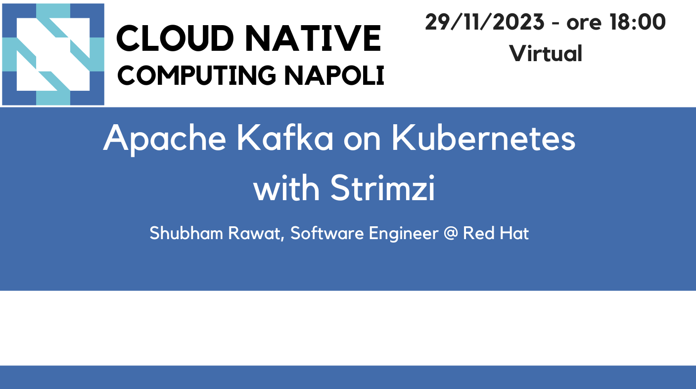

# Apache Kafka on Kubernetes with Strimzi - November 29, 2023

Following the material from the **"Apache Kafka on Kubernetes with Strimzi"** [meetup](https://community.cncf.io/events/details/cncf-napoli-presents-apache-kafka-on-kubernetes-with-strimzi/) on November 29, 2023 by Shubham Rawat, Software Engineer @ Red Hat.

Deploying Apache Kafka on Kubernetes is one great way to have production grade clusters for messaging and event streaming which are highly flexible, scalable and automated. But it is always a hard task when it comes to configure these clusters since you need to have very proficient knowledge of both Apache Kafka tooling and Kubernetes.

In this session, we will demonstrate the simplicity of deploying an Apache Kafka cluster on Kubernetes using the Strimzi operator, an open source CNCF project. It allows for a seamless integration with Kubernetes and provides a native experience when managing Kafka on it. From deployment to security, from upgrades to authentication and authorization, you will see how an operator can do everything for you.

* [slides]()
* [demo]()